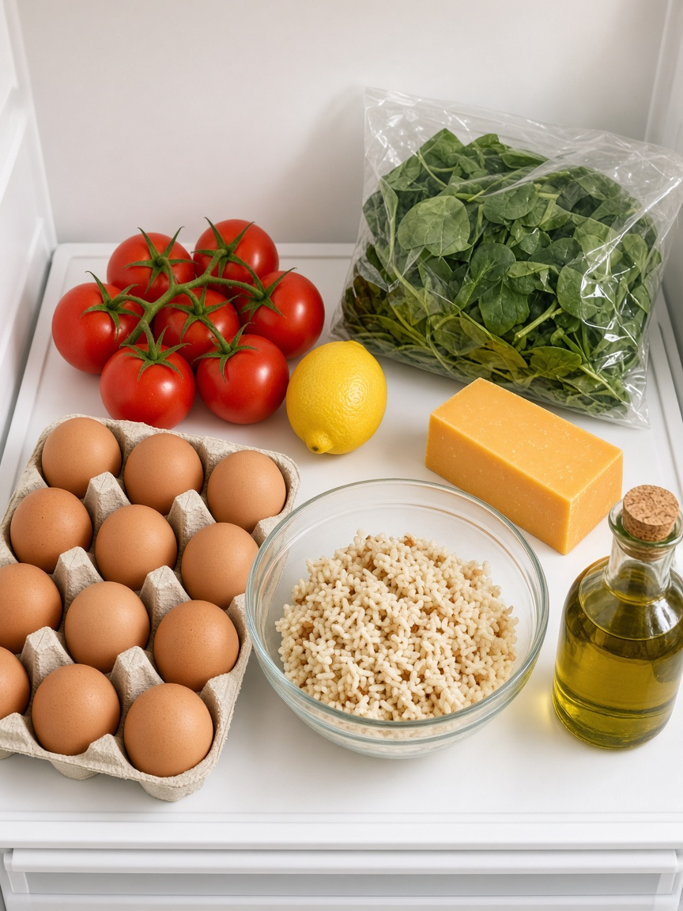

# 🥗 FridgeCook — Photo in. Three recipes out.

<p align="center">
  
</p>

<p align="center">
  
  
  
  
</p>

> Open the fridge. Snap a pic. Get **3 easy recipes** from what you already have. React Native CLI (**not Expo**). Google Gemini free vision API. No backend. No grocery list.

<p align="center">
  
</p>

---

## ✨ What you get

| Screen | What it does |
|--------|-------------|
| 🏠 **Home** | Camera or gallery, **Try a sample**, vibe pills (Anything / Veg / 15 min) |
| 🍽️ **Result** | 3 recipe cards: time, why it fits, ingredients, short steps |

- 📷 Real photo → Gemini vision
- ✨ Sample fridge if you don’t want to shoot
- 🥬 Vegetarian or 15-minute night
- 🔐 Key stays in `.env`

---

## 🏗️ How it works

```
Fridge photo (or sample list)
        ↓
base64 image + prompt
        ↓
Gemini generateContent
        ↓
JSON: seen foods + 3 recipes
        ↓
Result cards
```

Same idea as a weather API: URL, key, request, JSON. The model just looks at a picture.

---

## 🚀 Getting started

```bash
git clone https://github.com/Aishwaryaofficial/FridgeCook.git
cd FridgeCook
npm install

cp .env.example .env
# GEMINI_API_KEY=your_key   (https://aistudio.google.com/apikey)

# iOS
bundle install
cd ios && bundle exec pod install && cd ..

npm start
# other terminal
npm run ios
# or
npm run android
```

Restart Metro after changing `.env`.

### Try it

1. Tap **Try a sample** or pick a fridge photo
2. Pick **Anything**, **Veg**, or **15 min**
3. Tap **Cook these 3**

---

## 🛠️ Stack

- React Native 0.87 CLI
- TypeScript
- React Navigation 7
- `react-native-image-picker`
- Gemini 2.0 Flash (`inline_data` image)

---

## 🧪 Tests

```bash
npm test
```

---

## 📄 License

MIT
